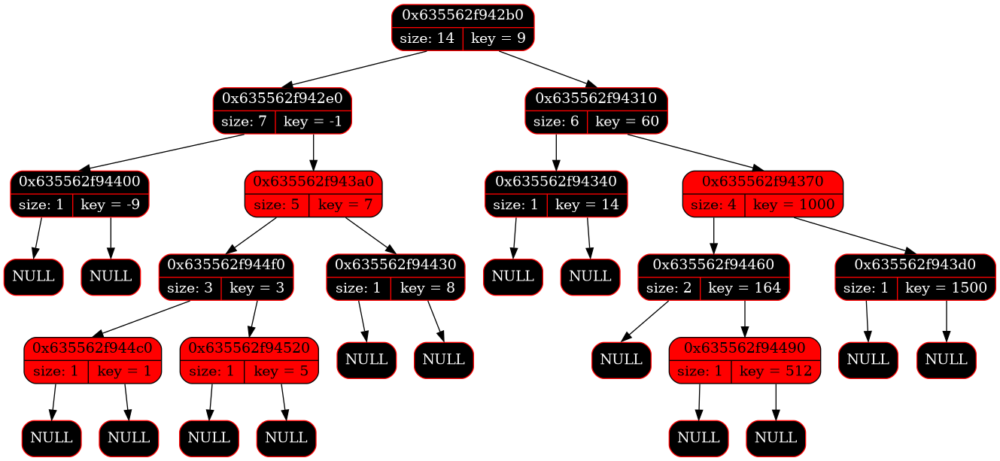
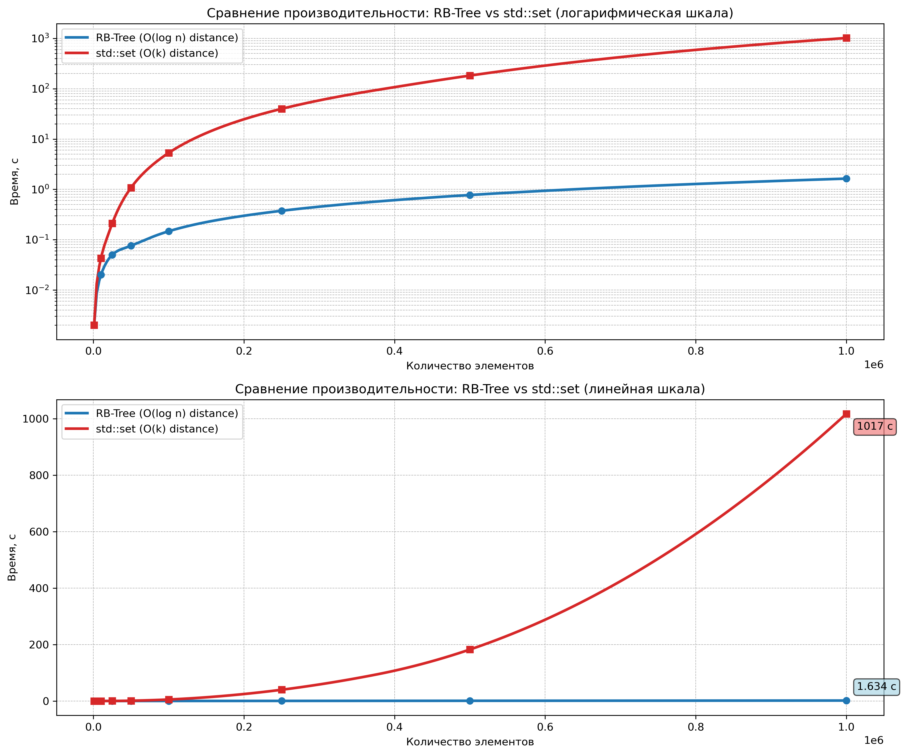

# HWT. Level 1: Balanced tree

Проект создан в рамках курса по $C$++ Константина Владимирова.

## Описание

Пусть на вход поступают ключи (каждый ключ это целое число, **все ключи
разные**) и запросы (каждый запрос это пара из двух целых чисел, **второе
больше первого**).

Нужно для каждого запроса подсчитать в дереве количество ключей, таких,
что все они лежат строго между его левой и правой границами включительно за `O(log(n))`.

## Требования
CMake с версией не меньше 3.11.

## Ввод/вывод
Со стандартного ввода программа получает строку вида:
```powershell
k 10 k 20 q 8 31 q 6 9 k 30 k 40 q 15 40
```

На выходе получаем количество ключей, таких, что все они лежат строго между его левой и правой границами включительно:
```powershell
2 0 3
```

## Компиляция
```powershell
cmake -S ./ -B build/ -DCMAKE_BUILD_TYPE=Release
cmake --build build/ --target tree
```

**Запуск google-тестов**:
```powershell
cmake --build build/ --target run_tests
```

**Запуск проекта**:
```powershell
./build/tree < path_to_test
```

Также в проекте реализованы макросы `TIME` и  `GPAPHVIZ_DUMP`, которые можно использовать для замеров времени работы красно-чёрного дерева и вывода отладочной информации в виде графического дампа. 

Для активации макросов необходимо собрать проект следующим образом:
```powershell
cmake -S . -B build -DCMAKE_CXX_FLAGS="-DTIME" 
# Или можно сразу два макроса: -DCMAKE_CXX_FLAGS="-DTIME -DGPAPHVIZ_DUMP"
```
```powershell
cmake --build build/ --target tree
```
```powershell
./build/tree < path_to_test
```


Пример графического дампа:



<br>

## Сравнение скорости работы дерева и std::set

Для сравнения скорости написан генератор "случайных" тестовых данных `./src/tree_generator.cpp`. 

С его помощью были сгенерированы 8 тестов в директории `./tests/` для разного размера входных данных. Обе реализации (`./src/tree.cpp` и `./src/std-set.cpp`) были запущены на этих тестах. Результаты работы на каждом тесте можно посмотреть в директории `./statistics/` в`./tree-time-results/` и `./set-time-results/`.

**Для замеров времени есть отдельный таргет**:
```powershell
cmake --build build/ --target benchmark
```

Итоговое время работы двух версий на тестах можно посмотреть в `./statistics/time_comparison.txt`. 

График зависимости времени от выходных данных можно посмотреть в `./statistics/tree_vs_set_performance.txt`. 

Вот пример графика:


